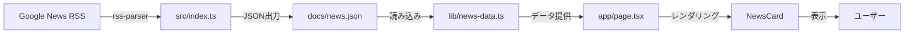

# Technical Specification - News Curation Bot v2.0

## プロジェクト概要

**News Curation Bot** は、Google News RSSから最新ニュースを自動収集し、モダンなWebダッシュボードで可視化するプロジェクトです。

### Project Clarus v2.0

本プロジェクトは **Project Clarus v2.0** として、NYT（New York Times）風のエディトリアルデザインを採用した高品質なニュースダッシュボードを提供します。

---

## 技術スタック

### Backend（ニュース収集Bot）

| 技術 | バージョン | 用途 |
|------|-----------|------|
| **Node.js** | 18.0.0+ | ランタイム環境 |
| **TypeScript** | 5.x | 型安全な開発 |
| **rss-parser** | - | Google News RSSのパース |
| **ESLint** | - | コード品質チェック |
| **Prettier** | - | コードフォーマット |

### Frontend（Webダッシュボード）

| 技術 | バージョン | 用途 |
|------|-----------|------|
| **Next.js** | 16.1.1 | React フレームワーク（App Router） |
| **React** | 19.2.3 | UIライブラリ |
| **TypeScript** | 5.x | 型安全な開発 |
| **Tailwind CSS** | 4.x | ユーティリティファーストCSS |
| **shadcn/ui** | - | UIコンポーネントライブラリ |
| **Lucide React** | 0.562.0 | アイコンライブラリ |
| **Radix UI** | - | アクセシブルなプリミティブコンポーネント |

#### Tailwind CSS プラグイン

- `@tailwindcss/postcss` v4
- `tw-animate-css` v1.4.0 - アニメーションユーティリティ

---

## ディレクトリ構造

```
news-curation-bot/
├── .github/
│   └── workflows/
│       ├── ci.yml              # CI ワークフロー
│       └── daily-news.yml      # 毎日自動実行（8:00 JST）
│
├── src/
│   └── index.ts                # ニュース収集メインロジック
│
├── docs/
│   └── news.json               # 収集されたニュースデータ
│
├── frontend/                   # Next.js Webダッシュボード
│   ├── app/
│   │   ├── layout.tsx          # ルートレイアウト
│   │   ├── page.tsx            # メインページ
│   │   ├── globals.css         # グローバルスタイル
│   │   └── favicon.ico
│   │
│   ├── components/
│   │   ├── news-card.tsx       # ニュースカードコンポーネント
│   │   └── ui/                 # shadcn/ui コンポーネント
│   │       ├── badge.tsx
│   │       ├── button.tsx
│   │       ├── card.tsx
│   │       └── tabs.tsx
│   │
│   ├── lib/
│   │   ├── news-data.ts        # ニュースデータ読み込みロジック
│   │   ├── types.ts            # TypeScript型定義
│   │   └── utils.ts            # ユーティリティ関数
│   │
│   ├── public/
│   │   ├── file.svg
│   │   ├── globe.svg
│   │   ├── next.svg
│   │   ├── vercel.svg
│   │   └── window.svg
│   │
│   ├── package.json
│   ├── tsconfig.json
│   ├── next.config.ts
│   ├── postcss.config.mjs
│   ├── eslint.config.mjs
│   └── components.json         # shadcn/ui 設定
│
├── dist/                       # ビルド成果物（Backend）
├── package.json                # Backend依存関係
├── tsconfig.json
├── .eslintrc.json
├── .prettierrc
├── README.md
└── TECHNICAL_SPEC.md           # 本ドキュメント
```

---

## デザインシステム

### デザインコンセプト

**NYT風エディトリアルデザイン** を採用し、以下の特徴を持ちます：

- 📰 **クラシック × モダン**: 新聞のような信頼感とモダンなUI/UXの融合
- 🎨 **OKLCHカラーモデル**: 知覚的に均一な色空間による美しいグラデーション
- 🌙 **ダークモード対応**: 目に優しい暗色テーマ
- ✨ **マイクロインタラクション**: ホバーエフェクトとスムーズなトランジション

### カラーシステム（OKLCH）

#### ライトモード

```css
--background: oklch(1 0 0);              /* 純白 */
--foreground: oklch(0.145 0 0);          /* ほぼ黒 */
--primary: oklch(0.205 0 0);             /* ダークグレー */
--secondary: oklch(0.97 0 0);            /* ライトグレー */
--muted: oklch(0.97 0 0);
--accent: oklch(0.97 0 0);
--border: oklch(0.922 0 0);
```

#### ダークモード

```css
--background: oklch(0.145 0 0);          /* ダークベース */
--foreground: oklch(0.985 0 0);          /* ほぼ白 */
--card: oklch(0.205 0 0);                /* カード背景 */
--primary: oklch(0.922 0 0);             /* ライトグレー */
--secondary: oklch(0.269 0 0);           /* ミディアムグレー */
--border: oklch(1 0 0 / 10%);            /* 半透明ボーダー */
```

#### チャートカラー

```css
--chart-1: oklch(0.488 0.243 264.376);   /* パープル */
--chart-2: oklch(0.696 0.17 162.48);     /* グリーン */
--chart-3: oklch(0.769 0.188 70.08);     /* イエロー */
--chart-4: oklch(0.627 0.265 303.9);     /* マゼンタ */
--chart-5: oklch(0.645 0.246 16.439);    /* オレンジ */
```

### タイポグラフィ

- **フォント**: Geist Sans（メイン）、Geist Mono（コード）
- **見出し**: 大胆で読みやすい階層構造
- **本文**: 適切な行間と文字間隔

### ボーダーラディウス

```css
--radius: 0.625rem;                      /* 10px - ベース */
--radius-sm: calc(var(--radius) - 4px);  /* 6px */
--radius-md: calc(var(--radius) - 2px);  /* 8px */
--radius-lg: var(--radius);              /* 10px */
--radius-xl: calc(var(--radius) + 4px);  /* 14px */
--radius-2xl: calc(var(--radius) + 8px); /* 18px */
```

---

## コンポーネント設計

### NewsCard コンポーネント

ニュース記事を表示するカードコンポーネント。

#### Props

```typescript
interface NewsCardProps {
  item: NewsItem;
}

interface NewsItem {
  id: string;
  title: string;
  url: string;
  source: string;
  publishedAt: string;
  category: string;
  importance: 'high' | 'medium' | 'low';
}
```

#### 重要度による視覚的差別化

| 重要度 | バッジ | ボーダー |
|--------|--------|----------|
| **High** | 🔥 Hot（赤） | 2px 赤ボーダー |
| **Medium** | ⚡ Important（黄） | 1px 黄ボーダー |
| **Low** | 📰 News（グレー） | 1px グレーボーダー |

#### インタラクション

- **ホバー効果**: `hover:shadow-lg` - シャドウが拡大
- **トランジション**: `transition-all duration-300` - スムーズな変化
- **背景**: `bg-slate-900/50 backdrop-blur` - 半透明ガラスモーフィズム

---

## データフロー



### ニュースデータ構造

```typescript
interface NewsData {
  updatedAt: string;
  items: NewsItem[];
}

interface NewsItem {
  id: string;
  title: string;
  url: string;
  source: string;
  publishedAt: string;
  category: string;
  importance: 'high' | 'medium' | 'low';
}
```

---

## 機能一覧

### 実装済み機能

- ✅ Google News RSSからのニュース自動収集
- ✅ カテゴリ別フィルタリング（AI・LLM、世界経済、金融速報）
- ✅ 重要度による視覚的ハイライト
- ✅ レスポンシブデザイン（モバイル対応）
- ✅ ダークモード
- ✅ 外部リンクへのナビゲーション
- ✅ GitHub Actions による毎日自動実行（8:00 JST）
- ✅ CI/CD パイプライン（Lint, Build チェック）

### 今後の拡張予定

- 🔲 検索機能
- 🔲 ブックマーク機能
- 🔲 ニュースの詳細プレビュー
- 🔲 ソーシャルシェア機能
- 🔲 RSS フィード配信

---

## 開発ワークフロー

### Backend（ニュース収集Bot）

```bash
# 依存関係インストール
npm install

# 開発モードで実行
npm run dev

# ビルド
npm run build

# 本番実行
npm run start

# Lint
npm run lint
npm run lint:fix

# フォーマット
npm run format
npm run format:check
```

### Frontend（Webダッシュボード）

```bash
cd frontend

# 依存関係インストール
npm install

# 開発サーバー起動
npm run dev

# ビルド
npm run build

# 本番サーバー起動
npm start

# Lint
npm run lint
```

---

## デプロイメント

### Vercel（推奨）

```bash
# Vercel CLIインストール
npm i -g vercel

# デプロイ
cd frontend
vercel
```

### 環境変数

現在、環境変数は不要です。将来的にAPI連携を追加する場合は以下を検討：

- `NEWS_API_KEY`: ニュースAPI キー
- `DATABASE_URL`: データベース接続文字列

---

## パフォーマンス最適化

### Next.js App Router の活用

- **Server Components**: デフォルトでサーバーサイドレンダリング
- **Static Generation**: ビルド時にページを事前生成
- **Image Optimization**: Next.js の自動画像最適化

### Tailwind CSS v4

- **JIT モード**: 使用されるクラスのみをビルド
- **CSS変数**: ランタイムでのテーマ切り替え

---

## アクセシビリティ

### Radix UI の活用

- **キーボードナビゲーション**: 完全対応
- **スクリーンリーダー**: ARIA属性の自動付与
- **フォーカス管理**: 適切なフォーカストラップ

### セマンティックHTML

- `<main>`, `<header>`, `<footer>` の適切な使用
- 見出しの階層構造（h1, h2, h3...）

---

## ブラウザサポート

| ブラウザ | サポート状況 |
|---------|-------------|
| Chrome | ✅ 最新版 |
| Firefox | ✅ 最新版 |
| Safari | ✅ 最新版 |
| Edge | ✅ 最新版 |
| IE11 | ❌ 非対応 |

---

## ライセンス

MIT License

---

## 変更履歴

### v2.0.0 (2026-01-07)

- ✨ Next.js フロントエンド追加
- ✨ NYT風エディトリアルデザイン採用
- ✨ OKLCHカラーモデル導入
- ✨ shadcn/ui コンポーネント統合
- ✨ Tailwind CSS v4 アップグレード

### v1.0.0 (初期リリース)

- ✨ Google News RSS 収集機能
- ✨ GitHub Actions 自動化
- ✨ TypeScript + ESLint + Prettier

---

## 開発者向けメモ

### shadcn/ui コンポーネントの追加

```bash
npx shadcn@latest add [component-name]
```

### Tailwind CSS のカスタマイズ

`frontend/app/globals.css` の `:root` と `.dark` セクションでカラー変数を編集してください。

### ニュースデータの構造変更

`frontend/lib/types.ts` で型定義を更新し、`src/index.ts` のデータ生成ロジックも合わせて修正してください。

---

**Last Updated**: 2026-01-07  
**Author**: imloveit0106  
**Project**: News Curation Bot - Project Clarus v2.0
